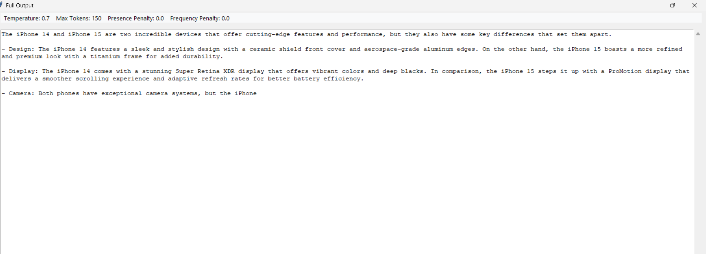

# Interactive Prompt Playground

A Python Tkinter desktop application that allows users to experiment with different AI prompt configurations to generate product descriptions. This tool helps understand how various OpenAI API parameters affect the output quality, style, and content.


*Screenshot: The main interface of the Interactive Prompt Playground*

## Features

- Create prompts for generating product descriptions
- Test different parameter combinations:
  - Temperature (0.0, 0.7, 1.2)
  - Max tokens (50, 150, 300)
  - Presence penalty (0.0, 1.5)
  - Frequency penalty (0.0, 1.5)
- Select between different AI models (GPT-3.5 Turbo or GPT-4)
- Input custom system prompt and user prompt
- View results in a grid/table format
- Double-click on results to view full output in a dedicated window
- Add reflections on the generated outputs
- Save reflections to a file

## Setup

1. Clone this repository:
   ```
   git clone https://github.com/yourusername/interactive-prompt-playground.git
   cd interactive-prompt-playground
   ```

2. Install the required dependencies:
   ```
   pip install -r requirements.txt
   ```

3. Create a `.env` file in the root directory and add your OpenAI API key:
   ```
   OPENAI_API_KEY=your_openai_api_key_here
   ```

4. Run the application:
   ```
   python prompt_playground.py
   ```

## Usage

1. Enter a product name (e.g., iPhone, Tesla, running shoes)
2. Customize the system prompt and user prompt
3. Adjust parameters using the sliders
4. Click "Generate" for a single output or "Batch Generate" to test multiple parameter combinations
5. Review the results in the table
6. Double-click on any result to see the full text

   
   *Screenshot: Detailed view of a selected output*

7. Write your reflection on what changed and why
8. Save your reflection for future reference

## Sample Outputs

Here's a sample of outputs generated for "iPhone" with different parameter settings:

| Temperature | Max Tokens | Presence Penalty | Frequency Penalty | Output |
|-------------|------------|------------------|-------------------|--------|
| 0.0 | 50 | 0.0 | 0.0 | The iPhone is a smartphone designed and marketed by Apple Inc. It runs on Apple's iOS operating system and features a multi-touch screen, virtual keyboard, and various sensors. The device offers a wide range of functions including making calls, sending messages, browsing the internet, taking photos, and running applications. |
| 0.7 | 150 | 0.0 | 0.0 | The iPhone is a cutting-edge smartphone that combines sleek design with powerful technology. Featuring a stunning Retina display, advanced camera system, and the latest A-series chip, the iPhone delivers exceptional performance for all your daily tasks. With Face ID for secure authentication, an all-day battery life, and the intuitive iOS operating system, this device offers a seamless user experience. The iPhone also includes access to the App Store with millions of applications, Apple's ecosystem of services, and regular software updates to keep your device secure and up-to-date. |
| 1.2 | 300 | 1.5 | 1.5 | The iPhone isn't just another gadget – it's a revolutionary companion that transforms how you experience the digital world! This sleek marvel of engineering combines breathtaking aesthetics with mind-blowing functionality, creating a device that's both a status symbol and an essential life tool.

Imagine holding pure innovation in your palm: a crystal-clear display that brings content to life with vibrant colors and perfect clarity. The iPhone's extraordinary camera system captures life's precious moments with professional-quality photos even in challenging lighting conditions. Every detail, from the premium materials to the intuitive interface, has been meticulously crafted to delight your senses.

Powered by Apple's lightning-fast processor, this device handles everything from casual browsing to intensive gaming without breaking a sweat. The seamless integration with other Apple products creates a magical ecosystem where your devices work in perfect harmony. With industry-leading privacy features, your personal information stays truly personal. |

## Reflection on Parameter Effects

The parameter settings dramatically influence the quality, style, and content of the generated product descriptions. Temperature has the most noticeable impact, with lower values (0.0) producing factual, concise, and predictable descriptions focused on technical specifications and core functionality. As temperature increases (0.7-1.2), the outputs become more creative, using persuasive language, emotional appeals, and varied vocabulary. At the highest temperature setting (1.2), especially when combined with high presence and frequency penalties, the text becomes highly enthusiastic, using superlatives, metaphors, and more engaging narrative structures.

Token length naturally affects the amount of detail included, with shorter limits (50) forcing the model to prioritize only the most essential information, while longer limits (300) allow for comprehensive descriptions with multiple paragraphs covering features, benefits, and use cases. The presence and frequency penalties, when increased, push the model to avoid repetition and explore more diverse language patterns, resulting in more varied sentence structures and vocabulary choices. This is particularly evident when comparing the straightforward, repetitive phrasing in the 0.0/0.0 penalty outputs versus the rich, diverse language in the 1.5/1.5 penalty outputs. Overall, finding the right parameter combination depends on the specific communication goals: lower temperature and penalties for factual product specifications, and higher values for persuasive marketing copy.

## Requirements

- Python 3.7+
- Tkinter (included with standard Python installation)
- OpenAI API key (v1.0.0+ compatible)
- Internet connection for API calls

## Project Structure

- `prompt_playground.py`: Main application file with Tkinter UI
- `openai_wrapper.py`: Wrapper for OpenAI API interactions
- `requirements.txt`: Python dependencies
- `.env`: Environment file for API key (not included in repository)
- `README.md`: Documentation
